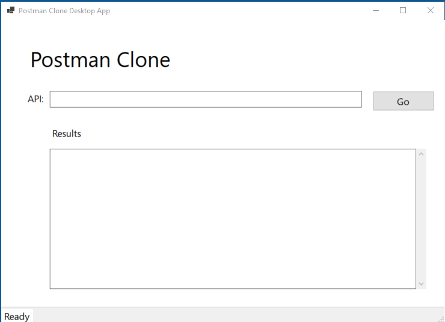
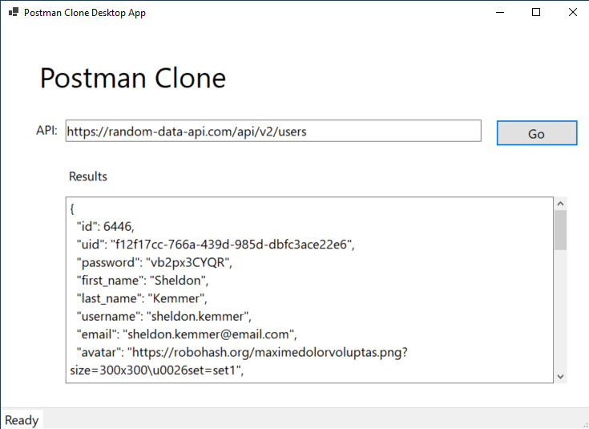

# PostmanCloneApp

Postman Clone use the same functionality as Postman App to retrieve the app payload of your choice, less options. You add API then GET, its retrieve api in JSON format. Ideal for developer and tester, this tool simplifies API interaction and debugging. It help you quicky look through your API response.

## Techonlogies Used
* C#
* .NET 8
* WinForms
* HttpClient

## How to use this simple Postman App
1. Download the executable file from the release section
2. When the application launches, it should look like the screen shot 1:
3. Fill in your API URL and hit GO screen shot 2:

## Upcoming changes
* Adding POST, PUT, PATCH, and DELETE functionality
* Adding API Header
* Adding API Authentication
* Adding DI
* Add Logging
* Create Web-base user interface
